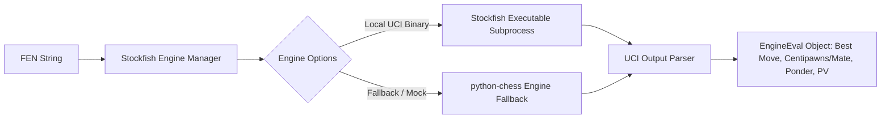
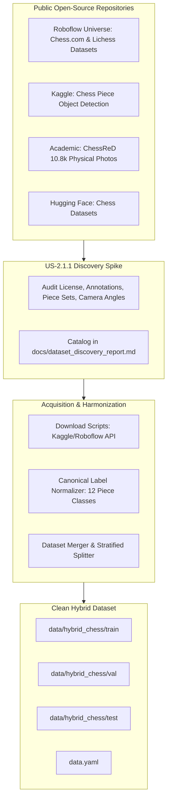
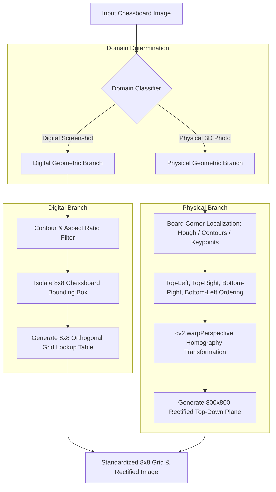
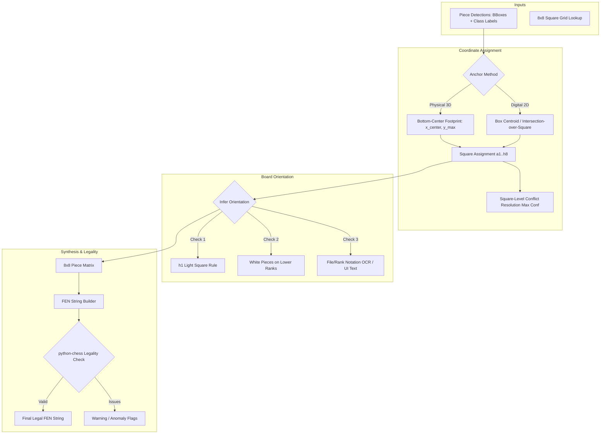
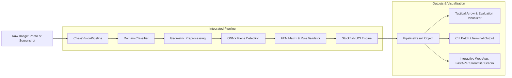

# ♟️ Product Backlog: Unified 2D/3D Chess Vision & Move Recommendation System

> **Tracking Convention:**
> - `[ ]` **Backlog / To Do**
> - `[-]` **In Progress**
> - `[x]` **Completed**
> - `[!]` **Blocked / Needs Clarification**
>
> *This backlog will be automatically updated as features, sub-tasks, and stories are developed and validated.*

---

## 📊 Summary & Progress Tracker

| Epic | Description | Features | Status |
| :--- | :--- | :---: | :---: |
| **EPIC-01** | Core Infrastructure, Tooling & Engine Evaluation | 2 | `[x]` Completed |
| **EPIC-02** | Open-Source Dataset Discovery, Ingestion & Curation | 3 | `[-]` In Progress |
| **EPIC-03** | Domain Classification & Geometric Pre-Processing | 3 | `[ ]` Not Started |
| **EPIC-04** | Chess Piece Detection & Recognition Model Architecture | 3 | `[ ]` Not Started |
| **EPIC-05** | Coordinate Mapping, Orientation & FEN Synthesis | 3 | `[ ]` Not Started |
| **EPIC-06** | End-to-End Pipeline, Move Recommendation & Visualization | 3 | `[ ]` Not Started |

---

## 🏆 EPIC-01: Core Infrastructure, Tooling & Engine Evaluation

### 📐 Epic Architecture Diagram

### 🔹 Feature 1.1: Environment & Project Scaffolding
- [x] **US-1.1.1: Project Configuration & Dependency Specification**
  - **Description:** Set up `pyproject.toml` / `requirements.txt` specifying Python 3.11, PyTorch (with CUDA 12.x support), `ultralytics`, `opencv-python`, `python-chess`, `albumentations`, `onnxruntime-gpu`, and `pytest`.
  - **Acceptance Criteria:**
    - [x] Clean installation in virtual environment.
    - [x] Script `scripts/verify_env.py` checks GPU availability, CUDA version, VRAM capacity, and key package imports.
  - 💡 **Architectural Notes & Alternatives:**
    - *Assumption:* Standard `requirements.txt` with PyTorch CUDA.
    - *Alternative Considered:* `uv` package manager / `poetry` / `pixi` for deterministic lockfiles and sub-second dependency resolution.
    - *Trade-off:* `uv` provides significantly faster container/local builds and seamless cross-platform CUDA wheel resolution. Configured `cu128` wheels for RTX 50-series Blackwell architecture (`sm_120`).

- [x] **US-1.1.2: Modular Directory Architecture**
  - **Description:** Initialize project package structure (`src/domain_classifier`, `src/geometry`, `src/detection`, `src/fen_mapper`, `src/engine`, `src/pipeline`, `src/utils`, `tests/`, `data/`, `configs/`).
  - **Acceptance Criteria:**
    - [x] Standard package layout with clean `__init__.py` exports and type hinting support.

### 🔹 Feature 1.2: Stockfish UCI Engine Wrapper
- [x] **US-1.2.1: Stockfish Engine Manager & Query Interface**
  - **Description:** Create an asynchronous/synchronous Stockfish manager using `python-chess` that takes a FEN string and parameters (e.g. depth, time limit) and returns the top move and evaluation score.
  - **Acceptance Criteria:**
    - [x] Automatically discovers or downloads/locates local Stockfish binary across platforms (Windows/Linux).
    - [x] Returns structured object: `best_move` (e.g., `e2e4`, `g1f3`), `eval_type` (cp/mate), `eval_value` (float/int), `ponder_move`, and PV lines.
    - [x] Handles edge cases: checkmate on board, stalemate, invalid FEN raises custom `InvalidFENError`.
  - 💡 **Architectural Notes & Alternatives:**
    - *Assumption:* Local native Stockfish 16.1/17 binary via UCI protocol with persistent process session.
    - *Alternative Considered:* Lichess Cloud Evaluation API (zero local CPU overhead, but network latency & rate limits) vs Stockfish WebAssembly/WASM vs third-party `stockfish` PyPI wrapper.
    - *Decision Recommendation:* Direct `python-chess` UCI protocol over OS pipe with persistent session pooling (<2ms latency vs 150ms re-spawning overhead). Windows `STARTUPINFO` suppression to prevent console popups. 3-tier auto-discovery (Env $\to$ `bin/` $\to$ PATH $\to$ on-demand GitHub release downloader) with a deterministic `python-chess` minimax fallback for CI environments. Terminal state pre-evaluation for checkmate/stalemate.

- [x] **US-1.2.2: Move Recommendation Unit Tests**
  - **Description:** Implement unit tests verifying evaluation against famous puzzle positions (e.g., Opera Game mate-in-2, smothered mate, standard opening e4/d4).
  - **Acceptance Criteria:**
    - [x] `pytest tests/test_engine.py` passes 100% with deterministic mock/live engine responses.

---

## 🏆 EPIC-02: Open-Source Dataset Discovery, Ingestion & Curation

### 📐 Epic Architecture Diagram

### 🔹 Feature 2.1: Dataset Discovery & Evaluation Spike
- [x] **US-2.1.1: [SPIKE] Open-Source Dataset Landscape Audit (Digital & Physical)**
  - **Description:** Research and catalog existing open-source chess piece detection datasets across Roboflow Universe, Kaggle, Hugging Face, and academic benchmarks.
  - **Acceptance Criteria:**
    - Document findings in `docs/dataset_discovery_report.md` detailing:
      - Digital datasets covering Chess.com, Lichess, and other chess apps (themes, resolutions, bounding box quality).
      - Physical 3D datasets covering real-life boards (ChessReD, multi-angle camera photos, wood/plastic pieces).
      - Annotation formats (YOLO txt, COCO JSON, Pascal VOC), class naming conventions, license, sample counts, and direct download links/APIs.
    - Select top curated candidates for the unified training pool.
  - 💡 **Architectural Notes & Alternatives:**
    - *Assumption:* Hybrid object detection dataset (bounding boxes for each piece).
    - *Alternative Paradigm Considered:* Square-crop classification dataset (64 cropped square images per board classified into 13 classes: empty + 12 pieces).
    - *Comparative Advantage:* Object detection handles overlapping pieces in 3D angled shots better; 64-square classification is faster and simpler for perfectly rectified 2D digital boards. We should evaluate if curated datasets provide both formats or if bounding boxes give the most versatile single-model solution.

### 🔹 Feature 2.2: Automated Dataset Download & Ingestion
- [x] **US-2.2.1: Physical Dataset Downloader (ChessReD & Real-Life Photos)**
  - **Description:** Create an automated ingestion pipeline for ChessReD (10,800+ real-world photos) and curated physical board datasets from Kaggle / Roboflow.
  - **Acceptance Criteria:**
    - Script `scripts/download_physical_datasets.py` fetches and extracts raw images and annotations to `data/raw/physical/`.
    - Handles authentication / API keys safely (e.g., Kaggle CLI, Roboflow Python SDK).

- [x] **US-2.2.2: Digital 2D App Dataset Downloader (Chess.com / Lichess / Other Apps)**
  - **Description:** Create an automated ingestion script for verified open-source digital 2D screenshot datasets (Chess.com themes, Lichess themes, custom digital apps).
  - **Acceptance Criteria:**
    - Script `scripts/download_digital_datasets.py` fetches and extracts digital datasets to `data/raw/digital/`.

### 🔹 Feature 2.3: Label Standardization & Unified Hybrid Dataset Builder
- [x] **US-2.3.1: Canonical Class Name & Coordinate Standardizer**
  - **Description:** Map heterogeneous class naming schemes (e.g. `['wP', 'bK']`, `['white-queen', 'black-rook']`, `[0..11]`, `['W_P', 'B_K']`) from multiple disparate datasets into the project's canonical 12 piece labels:
    `[white_pawn, white_knight, white_bishop, white_rook, white_queen, white_king, black_pawn, black_knight, black_bishop, black_rook, black_queen, black_king]`.
  - **Acceptance Criteria:**
    - Standardizes all bounding boxes to normalized YOLO format (`class_id x_center y_center width height`).
    - Enforces epsilon boundary clamping ($[-10^{-5}, 1.0 + 10^{-5}] \to [0.0, 1.0]$) to eliminate floating-point precision drift.
    - Validates coordinates ($0.0 \le x, y, w, h \le 1.0$) and removes corrupted, zero-area, or degenerate annotations ($w < 0.005$ or $h < 0.005$).
    - Groups classes numerically: $0..5$ White (`white_pawn`..`white_king`), $6..11$ Black (`black_pawn`..`black_king`), enabling direct `class_id < 6` color checks and `class_id % 6` `python-chess` piece mappings.
  - 💡 **Architectural Notes & Alternatives (See ADR-008):**
    - *Class Ontology (12 vs. 13 Classes):* 12 piece classes is optimal for bounding box object detection (YOLOv8/11/RT-DETR). The background is implicitly modeled as negative samples; injecting an explicit `empty_square` bounding box class causes severe anchor clutter (32+ overlapping boxes on empty tiles) and degrades NMS. The 13-class paradigm is used strictly in 64-patch tile classifiers (e.g., ChessCog, LiveChess2FEN), not object detectors.
    - *Decoupled Board Corners:* Board corners are excluded from the piece detector bounding boxes and handled by dedicated geometric homography / YOLO-Pose keypoints (EPIC-03), avoiding loose corner boxes that lack sub-pixel vertex precision.
    - *Parallax-Free Anchoring:* Standardizes bounding boxes around full visible piece bodies, while downstream coordinate mapping (EPIC-05) uses bottom-center base contact points $(x_c, y_c + h/2)$ to eliminate perspective tilt errors for tall pieces.

- [ ] **US-2.3.2: Hybrid Dataset Merger, Deduplication & YOLO Splitter**
  - **Description:** Merge physical and digital subsets into a balanced hybrid dataset (`data/hybrid_chess/`) with stratified train/validation/test splits (e.g., 70/15/15) and generate `data.yaml`.
  - **Acceptance Criteria:**
    - Generates balanced `data/hybrid_chess/train`, `data/hybrid_chess/val`, `data/hybrid_chess/test`.
    - Generates `data/hybrid_chess/data.yaml` compatible with Ultralytics YOLO with canonical 12 class names.
    - Includes negative samples (empty background boards) with 0-byte `.txt` files to suppress false positive detections on empty squares.
    - Script `scripts/visualize_hybrid_dataset.py` creates sample overlays for visual QA of both digital and physical samples.

---

## 🏆 EPIC-03: Domain Classification & Geometric Pre-Processing

### 📐 Epic Architecture Diagram

### 🔹 Feature 3.1: Automatic Input Domain Classifier
- [ ] **US-3.1.1: Statistical Heuristics Domain Classifier**
  - **Description:** Implement a fast, zero-weight classifier using Laplacian variance (blur/texture detection), HSV color palette entropy/uniqueness, and edge line density.
  - **Acceptance Criteria:**
    - Returns `Domain.DIGITAL` or `Domain.PHYSICAL` with confidence score in < 2ms.
    - Achieves > 99% accuracy on standard validation test set of screenshots vs photos.
  - 💡 **Architectural Notes & Alternatives:**
    - *Assumption:* Statistical heuristics (Laplacian variance + color histogram peaks) can differentiate clean flat digital pixels from natural camera noise/lighting.
    - *Alternative Considered:* Zero-shot CLIP classifier (`"a clean digital screenshot of a chessboard"` vs `"a photograph of a physical chess board"`) or a lightweight 1MB MobileNetV4.
    - *Trade-off:* Heuristic classifier has 0ms neural latency and zero dependency overhead, but could struggle with photos taken of computer screens (moiré patterns). A lightweight CNN / fallback is great for edge cases.

- [ ] **US-3.1.2: Lightweight CNN Classifier (Fallback / High Accuracy)**
  - **Description:** Train/export a tiny MobileNetV3 / custom CNN classifier (under 2MB) for robust domain classification in ambiguous edge cases (e.g., photos of digital monitors).
  - **Acceptance Criteria:**
    - Exported to ONNX with sub-5ms inference.

### 🔹 Feature 3.2: Digital Board Localization & Orthogonal Slicing
- [ ] **US-3.2.1: Digital Chessboard Boundary Detection**
  - **Description:** Detect the square digital chessboard boundary using contour filtering, edge detection, and aspect-ratio verification ($\approx 1.0$).
  - **Acceptance Criteria:**
    - Accurately crops the 8x8 board from full-screen browser/app screenshots.
    - Handles variable UI surroundings (clocks, player avatars, notation bars).
  - 💡 **Architectural Notes & Alternatives:**
    - *Assumption:* Digital boards are strictly orthogonal squares with distinct borders.
    - *Alternative Considered:* Color segmentation on board alternating tiles (green/white, brown/cream) + morphological closing to find the largest bounding square.
    - *Trade-off:* Color segmentation is robust against varying browser backgrounds and dark/light modes.

- [ ] **US-3.2.2: Orthogonal 8x8 Grid Slicer**
  - **Description:** Partition the cropped digital board into an exact $8 \times 8$ grid of square coordinates (`[rank, file] -> (x_min, y_min, x_max, y_max)`).
  - **Acceptance Criteria:**
    - Provides coordinate lookup matrix for rapid bounding-box-to-square mapping.

### 🔹 Feature 3.3: Physical Board Corner Detection & Homography
- [ ] **US-3.3.1: 4-Corner Localization for Angled Boards**
  - **Description:** Detect the 4 outermost corners of a physical chessboard using Hough Line intersection / contour quad-approximation / keypoint detection.
  - **Acceptance Criteria:**
    - Accurately identifies Top-Left, Top-Right, Bottom-Right, Bottom-Left board corners under tilts up to 60 degrees.
  - 💡 **Architectural Notes & Alternatives:**
    - *Assumption:* Classical OpenCV Canny + Hough Line intersection or contour polygon approximation (`cv2.approxPolyDP`).
    - *Alternative Considered:* Deep Learning Keypoint Detector (e.g., YOLO-Pose or a 4-point heatmap model) or Line Segment Detector (LSD / DeepLSD).
    - *Trade-off:* Classical OpenCV works well when board borders are clear and unoccluded, but deep keypoint estimation is significantly more robust against severe lighting, hands over the board, or complex wood grain patterns.

- [ ] **US-3.3.2: Perspective Homography Warper (`cv2.warpPerspective`)**
  - **Description:** Compute homography matrix and warp the detected quad into an undistorted top-down square ($800 \times 800$ px).
  - **Acceptance Criteria:**
    - Produces rectified top-down planar image with aligned grid lines.

---

## 🏆 EPIC-04: Chess Piece Detection & Recognition Model Architecture

### 📐 Epic Architecture Diagram

```mermaid
flowchart LR
    subgraph Input
        Img[Pre-Processed Chess Image]
    end

    subgraph Architecture_Tradeoffs [Model Architecture Evaluation]
        OptA[Option A: Single-Stage YOLOv8m/YOLO11m]
        OptB[Option B: 2-Stage Grid Patch Classifier]
        OptC[Option C: Transformer-Based RT-DETR / ViT]
    end

    subgraph Inference_Engine [Optimized Runtime]
        Model[Selected Model Weights: best.pt]
        Model --> ONNX[ONNX Export with Dynamic Shapes]
        ONNX --> ORT[ONNX Runtime GPU CUDA Provider]
    end

    subgraph Outputs
        ORT --> BBoxes[Piece BBoxes & Class Probabilities: sub-20ms]
    end

    Img --> Architecture_Tradeoffs
    Architecture_Tradeoffs --> Inference_Engine
```

### 🔹 Feature 4.1: Model Architecture & Training Pipeline
- [ ] **US-4.1.1: Detection Model Architecture Selection & Training Pipeline**
  - **Description:** Configure fine-tuning pipeline for YOLOv8m / YOLO11m (and evaluate RT-DETR / 2-Stage classifier) with mixed precision (AMP/FP16) on a 16GB VRAM GPU.
  - **Acceptance Criteria:**
    - Training script supports AMP (`fp16=True`), image caching, cosine LR schedule, and early stopping.
    - Fits comfortably within 16GB VRAM with optimal batch size (e.g., batch 16 or 32 at 640x640 / 800x800).
    - Logs training metrics (loss, mAP@50, mAP@50-95) to TensorBoard / Weights & Biases.
  - 💡 **Architectural Notes & Alternatives:**
    - *Assumption:* YOLOv8m / YOLO11m object detection (bounding boxes over whole board).
    - *Alternative Considered 1: 2-Stage Patch Classifier.* Crop each of the 64 squares after grid alignment and pass through an ultra-fast MobileNet/ResNet 13-class classifier. (Benefits: Invariant to board-level clutter; 100% guarantees exactly 1 classification per square).
    - *Alternative Considered 2: RT-DETR (Real-Time Detection Transformer).* End-to-end NMS-free transformer detector with high accuracy on dense small objects.
    - *Decision Recommendation:* Implement YOLOv8m/11m as the primary baseline, while keeping the pipeline modular so a 64-patch classifier or RT-DETR can be plugged in or benchmarked during evaluation.

- [ ] **US-4.1.2: Checkpoint Management & Best Weights Selection**
  - **Description:** Implement model checkpoint saving, validation loss monitoring, and export of `best.pt`.
  - **Acceptance Criteria:**
    - Automatically saves optimal weights with reproducible configuration YAML.

### 🔹 Feature 4.2: Model Evaluation & Benchmarking
- [ ] **US-4.2.1: Detection Evaluation & Confusion Matrix**
  - **Description:** Evaluate trained model on test split across both digital (Chess.com/Lichess/other) and physical (ChessReD/photos) test sets separately and combined.
  - **Acceptance Criteria:**
    - Generates precision, recall, mAP@0.5 (> 0.95 target), mAP@0.5:0.95 (> 0.80 target).
    - Produces confusion matrix highlighting any piece ambiguity (e.g., Bishop vs Pawn, Queen vs King).

### 🔹 Feature 4.3: ONNX Export & Latency Optimization
- [ ] **US-4.3.1: ONNX Model Export & Dynamic Batching**
  - **Description:** Export `best.pt` to ONNX format with simplified operations (`opset=17`) and dynamic shape handling.
  - **Acceptance Criteria:**
    - Generates `models/chess_piece_detector.onnx`.

- [ ] **US-4.3.2: ONNX Runtime GPU Inference Engine**
  - **Description:** Implement high-throughput inference wrapper using `onnxruntime-gpu` (CUDA Execution Provider).
  - **Acceptance Criteria:**
    - Benchmarks inference latency: achieves $< 20\text{ ms}$ per image on local GPU.
  - 💡 **Architectural Notes & Alternatives:**
    - *Assumption:* ONNX Runtime with CUDA EP.
    - *Alternative Considered:* TensorRT engine conversion (`.engine` via `trtexec`).
    - *Trade-off:* TensorRT provides maximum sub-10ms performance on NVIDIA GPUs, but requires platform-specific compilation; ONNX Runtime is portable with near-TensorRT speed when using CUDA EP.

---

## 🏆 EPIC-05: Coordinate Mapping, Orientation & FEN Synthesis

### 📐 Epic Architecture Diagram

### 🔹 Feature 5.1: Spatial Anchor Mapping to 8x8 Grid
- [ ] **US-5.1.1: Bottom-Center $(x, y_{bottom})$ Footprint Anchor Strategy**
  - **Description:** Map physical piece detections using the bottom-center coordinate of each bounding box $(x_{center}, y_{max})$ instead of the box center, preventing tall pieces (Queens, Kings, Rooks) from spilling into adjacent/higher rank squares.
  - **Acceptance Criteria:**
    - Correctly assigns pieces to their occupied physical square even with acute camera angles.
  - 💡 **Architectural Notes & Alternatives:**
    - *Assumption:* Bottom-center $(x_{center}, y_{max})$ accurately identifies the base contact point with the board square.
    - *Alternative Considered:* Elliptical piece base estimation or 3D bounding box footprint estimation.
    - *Trade-off:* Bottom-center point projection is computationally trivial and highly effective when combined with homography-rectified top-down planes.

- [ ] **US-5.1.2: Spatial Conflict Resolution & NMS per Square**
  - **Description:** If multiple detections map to the same square, resolve conflict by selecting the detection with highest confidence score or applying square-level NMS.
  - **Acceptance Criteria:**
    - Guarantees at most 1 piece per square in the $8 \times 8$ matrix.

### 🔹 Feature 5.2: Board Orientation Detection
- [ ] **US-5.2.1: Color & Coordinate Convention Resolver**
  - **Description:** Determine whether White or Black is at the bottom using standard conventions (h1 square is light; White pieces typically on rank 1-2 vs Black on rank 7-8).
  - **Acceptance Criteria:**
    - Reliably infers board orientation for White-bottom, Black-bottom, or flipped perspectives.
  - 💡 **Architectural Notes & Alternatives:**
    - *Assumption:* Piece distribution (White pieces clustered near bottom = White perspective) and h1 light square rule.
    - *Alternative Considered:* OCR / Template matching of algebraic coordinate labels ('a'-'h', '1'-'8') along the board border; UI player indicators (names/ratings at top vs bottom in digital apps).
    - *Decision Recommendation:* Combine multi-signal consensus: (1) h1 color rule, (2) Piece color rank distribution, (3) Coordinate label detection if visible, (4) User override flag (`--flip / --black-perspective`).

### 🔹 Feature 5.3: FEN Builder & Chess Rule Validator
- [ ] **US-5.3.1: 8x8 Board Matrix to FEN Serializer**
  - **Description:** Convert $8 \times 8$ character matrix into standard FEN board placement string (e.g. `rnbqkbnr/pppppppp/8/8/8/8/PPPPPPPP/RNBQKBNR`).
  - **Acceptance Criteria:**
    - Handles empty square counters (`1`-`8`) and rank separators (`/`) according to FEN specification.

- [ ] **US-5.3.2: Chess Legality & Sanity Checker**
  - **Description:** Validate piece counts and legality using `python-chess` (e.g. exactly 1 White King, 1 Black King, $\le 8$ pawns per side, pawns not on rank 1 or 8).
  - **Acceptance Criteria:**
    - Outputs validation warning/error flags if board state violates FEN legality.
    - Infers active color (or allows user override) and default castling/en-passant fields.
  - 💡 **Architectural Notes & Alternatives:**
    - *Assumption:* Active player turn (White 'w' vs Black 'b') defaults to White or is inferred.
    - *Alternative Considered:* In digital screenshots, detect active turn indicator (clock highlight, move arrow on digital boards, dot next to player name). In physical boards, test if side in check is active.

---

## 🏆 EPIC-06: End-to-End Pipeline, Move Recommendation & Visualization

### 📐 Epic Architecture Diagram

### 🔹 Feature 6.1: Unified Inference Pipeline
- [ ] **US-6.1.1: Master Pipeline Orchestrator**
  - **Description:** Integrate Domain Classifier $\to$ Geometric Preprocessing $\to$ Piece Detection $\to$ FEN Mapping $\to$ Stockfish Query into a unified class `ChessVisionPipeline`.
  - **Acceptance Criteria:**
    - Accepts raw image path, numpy array, or PIL image.
    - Returns structured result: `PipelineResult(fen, best_move, evaluation, domain, processed_image, confidence)`.
    - Handles end-to-end execution in $< 100\text{ ms}$ total latency.

### 🔹 Feature 6.2: Move Visualizer & Image Annotator
- [ ] **US-6.2.1: Tactical Arrow & Board Overlay Renderer**
  - **Description:** Render the Stockfish best move as a smooth semi-transparent arrow (e.g. from `e2` to `e4`) overlaid directly on the original input image.
  - **Acceptance Criteria:**
    - Draws starting square highlight, destination square highlight, and vector arrow.
    - Overlays evaluation badge (e.g., `+1.8`, `M2`) and generated FEN text.
  - 💡 **Architectural Notes & Alternatives:**
    - *Assumption:* Single best move arrow + evaluation text overlay.
    - *Alternative Considered:* Multi-PV top 3 moves with color-coded arrows (green = best, blue = alternative, red = tactical threat), alongside an interactive evaluation bar similar to Chess.com / Lichess.

### 🔹 Feature 6.3: CLI & Interactive User Interface
- [ ] **US-6.3.1: Command-Line Interface (CLI)**
  - **Description:** Build `chess_vision_cli.py` for batch processing or single image analysis (`python cli.py --image board.jpg --engine-depth 15`).
  - **Acceptance Criteria:**
    - Outputs FEN, best move, and saves annotated image to output directory.

- [ ] **US-6.3.2: Interactive Web App (FastAPI / Streamlit / Gradio)**
  - **Description:** Create an interactive web interface allowing users to upload screenshots/photos or capture via webcam, displaying real-time FEN and Stockfish move recommendations.
  - **Acceptance Criteria:**
    - Drag-and-drop image upload.
    - Side-by-side display of original image, detected board state, Stockfish top moves, and interactive chessboard.
  - 💡 **Architectural Notes & Alternatives:**
    - *Alternatives Considered:*
      - **Gradio / Streamlit:** Fast prototyping with built-in webcam and image widgets.
      - **FastAPI + Vanilla Web UI:** Maximum flexibility, lightweight, deployable anywhere with zero bloated dependencies.

---

## 🔄 Auto-Update & Maintenance Protocol
When working on any story in this project:
1. Mark the story as `[-] In Progress` when beginning implementation.
2. Complete code changes and add corresponding unit/integration tests.
3. Verify test passes and mark the story as `[x] Completed`.
4. Update the **Summary & Progress Tracker** table to reflect current progress.
