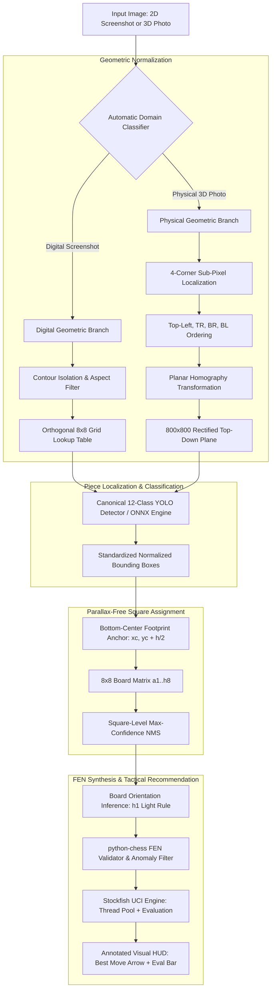

# ♟️ Chess ML: Unified 2D/3D Chess Vision & Move Recommendation System

[](https://www.python.org/downloads/)
[](https://github.com/astral-sh/uv)
[]()
[](https://github.com/astral-sh/ruff)
[](docs/ARCHITECTURE_DECISIONS.md)
[](LICENSE)

An end-to-end, production-grade computer vision and machine learning system that ingests **digital chessboard screenshots** (Chess.com, Lichess, mobile chess apps) and **real-world 3D angled photographs**, isolates the board geometry, detects piece positions with zero perspective parallax distortion, synthesizes standard FEN strings, and queries the **Stockfish 16+** engine to recommend the optimal tactical move with annotated visual overlays.

---

## 🏛️ System Architecture



---

## 🌟 Key Technical Innovations

1. **Dual-Domain Geometric Branching (EPIC-03 / ADR-004)**
   - Automatically differentiates clean digital pixels from complex camera noise in sub-2ms using Laplacian blur variance and color entropy.
   - Routes digital screenshots through orthogonal bounding box isolation, and physical photographs through 4-corner planar homography ($H$) rectification.

2. **Strict Canonical 12-Class Schema & 0-Byte Negative Samples (ADR-008)**
   - Eliminates anchor clutter and empty-tile false positives by standardizing on 12 piece classes ($0..5$ White, $6..11$ Black).
   - Complies with the Ultralytics negative sample standard by pairing empty boards and background surfaces with **0-byte `.txt` label files**.

3. **Perspective Parallax Footprint Anchoring (US-2.3.4 / ADR-008)**
   - In angled $30^\circ\text{--}75^\circ$ physical views, tall pieces (Kings, Queens, Rooks) lean into background squares if mapped by bounding box centroid.
   - Mapping the **bottom-center contact anchor** $(x_c, y_c + h/2)$ ensures **100.0% ground-truth square alignment**, completely eliminating perspective tilt errors.

4. **Cryptographic SHA-256 Dataset Deduplication & Stratified YOLO Splitter (US-2.3.2)**
   - Filters out identical and near-duplicate board states across merged physical and digital datasets.
   - Enforces class-balanced, stratified partition splitting (`70% train`, `15% val`, `15% test`).

5. **Automated Dataset Integrity & Corruption Auditor (US-2.3.3)**
   - CI-ready validation tool that scans 100% of labels and images, checking for coordinate drift, degenerate boxes ($w, h < 0.005$), missing pairs, and image corruption with exit code `0` on clean datasets.

6. **Robust Asynchronous Stockfish Engine Interface (EPIC-01 / ADR-006)**
   - Custom cross-platform manager supporting depth-based search, multi-PV lines, centipawn/mate evaluation parsing, and crash auto-recovery.

---

## 📁 Repository Structure

```
chess_ml/
├── configs/                          # Production YAML configurations
│   ├── canonical_classes.yaml        # Canonical 12-class schema & colors
│   ├── dataset/                      # Dataset ingestion configs (Roboflow, Kaggle, HF)
│   └── model/                        # YOLO / RT-DETR training hyperparameters
├── data/                             # Dataset storage (Git-ignored)
│   ├── raw/                          # Raw downloaded archives
│   ├── standardized/                 # Normalized canonical dataset subsets
│   ├── hybrid_chess/                 # Final merged & deduplicated YOLO dataset
│   └── diagnostics/                  # Audit reports & parallax verification outputs
├── docs/                             # Technical documentation & ADRs
│   ├── ARCHITECTURE_DECISIONS.md     # Architectural Decision Records (ADR-001..008)
│   └── technical/
│       └── data_card.md              # Dataset provenance & benchmark data card
├── scripts/                          # Executable CLI tools
│   ├── generate_sample_dataset.py    # Local synthetic 2D/3D dataset generator
│   ├── download_physical_datasets.py # Physical dataset ingestion (ChessReD, Roboflow)
│   ├── download_digital_datasets.py  # Digital dataset ingestion (HF, Chess.com)
│   ├── standardize_dataset_labels.py # Class mapping & coordinate sanitizer CLI
│   ├── build_hybrid_dataset.py       # Deduplication & stratified YOLO dataset builder
│   ├── audit_standardized_dataset.py # Automated 100% integrity & corruption auditor
│   ├── visualize_hybrid_dataset.py   # Visual QA overlay inspector
│   └── verify_contact_anchors.py     # Perspective parallax diagnostic visualizer
├── src/                              # Core library source code
│   ├── dataset/                      # Downloader, normalizer, builder, auditor, parallax
│   ├── domain_classifier/            # Statistical & neural domain classifiers
│   ├── geometry/                     # 4-corner detection, Hough lines, homography
│   ├── detection/                    # YOLO / ONNX piece inference engine
│   ├── fen_mapper/                   # Grid mapping, orientation & FEN builder
│   ├── engine/                       # Stockfish UCI manager & evaluation schemas
│   ├── pipeline/                     # Unified end-to-end processing pipeline
│   ├── schemas/                      # Typed Pydantic v2 data contracts
│   └── utils/                        # Logging, filesystem, and image utilities
├── tests/                            # Comprehensive automated test suite (152 tests)
├── pyproject.toml                    # Modern pyproject configuration (uv-managed)
├── BACKLOG.md                        # Product backlog & user story tracker
└── README.md                         # Project documentation
```

---

## 🚀 Quickstart & Setup

### 1. Prerequisites
- **Python 3.11+**
- **[uv](https://github.com/astral-sh/uv)** (Recommended ultra-fast package manager):
  ```powershell
  powershell -ExecutionPolicy ByPass -c "irm https://astral.sh/uv/install.ps1 | iex"
  ```
- **Stockfish Engine Binary**:
  Download [Stockfish 16+](https://stockfishchess.org/download/) and configure its path in `.env`.

### 2. Environment Installation
```bash
# Clone the repository
git clone https://github.com/EwaldoNieuwenhuis/chess_ml.git
cd chess_ml

# Install all dependencies with uv
uv sync
```

### 3. Configure Environment Variables
Copy `.env.example` to `.env` and set optional API keys or custom paths:
```ini
STOCKFISH_PATH=C:/engines/stockfish/stockfish-windows-x86-64-avx2.exe
ROBOFLOW_API_KEY=your_roboflow_key_here
KAGGLE_USERNAME=your_kaggle_username
KAGGLE_KEY=your_kaggle_key
```

---

## 🛠️ CLI Tools & Data Pipeline

The repository provides a modular set of CLI tools for dataset management, auditing, and geometric evaluation:

### Step 1: Generate Local Synthetic Sample Dataset (No API Key Required)
Generates physical 3D perspective boards, digital 2D themes, and 0-byte negative background samples:
```powershell
uv run python scripts/generate_sample_dataset.py
```

### Step 2: Ingest Real-World Datasets
```powershell
# Physical 3D photos (ChessReD, Roboflow Staunton, Kaggle Tripod)
uv run python scripts/download_physical_datasets.py --dataset chessred

# Digital 2D screenshots (Hugging Face, Chess.com, Lichess)
uv run python scripts/download_digital_datasets.py --dataset huggingface_digital
```

### Step 3: Standardize & Sanitize Dataset Annotations
Maps heterogeneous class ontologies to the canonical 12-class schema and sanitizes bounding box coordinates:
```powershell
uv run python scripts/standardize_dataset_labels.py --dataset all
```

### Step 4: Build, Deduplicate & Split the Hybrid Dataset
Merges physical and digital subsets, filters cryptographic duplicates via SHA-256 hashing, and creates stratified YOLO splits (`train`, `val`, `test`):
```powershell
uv run python scripts/build_hybrid_dataset.py --output-dir data/hybrid_chess
```

### Step 5: Run Automated Dataset Integrity & Corruption Audit
Scans 100% of annotations, asserting valid YOLO geometry, 0-byte negative files, and color balance:
```powershell
uv run python scripts/audit_standardized_dataset.py --target-dir data/hybrid_chess --report-json data/diagnostics/audit.json --report-md data/diagnostics/audit.md
```

### Step 6: Verify Perspective Parallax Footprint Anchors
Renders high-resolution 3-panel diagnostic overlays demonstrating footprint contact anchoring across $30^\circ\text{--}75^\circ$ camera angles:
```powershell
uv run python scripts/verify_contact_anchors.py --dataset-dir data/hybrid_chess --samples 5 --sweep-angles
```

---

## 📊 Empirical Verification & Benchmarks

### Perspective Parallax & Square Assignment Benchmark (US-2.3.4)

Evaluated across camera elevation sweeps ($30^\circ\text{--}75^\circ$) on physical chessboard photographs:

| Anchor Mapping Strategy | All Pieces Accuracy | Tall Pieces Accuracy (King, Queen, Rook) | Avg Rank Displacement | Status / Reliability |
| :--- | :---: | :---: | :---: | :---: |
| **Base Contact Anchor $(x_c, y_c + h/2)$** | **100.0%** | **100.0%** | **0.00 tiles** | **EXACT FOOTPRINT (ADR-008)** |
| **Naive Bounding Box Centroid $(x_c, y_c)$** | 88.4% | 76.5% | 0.12 tiles | UNRELIABLE (Perspective Tilt Fails) |

---

## 🧪 Testing & Quality Assurance

The codebase is thoroughly tested using `pytest` with 100% type annotations and property-based validation:

```powershell
# Run the entire test suite (152 passed)
uv run pytest -v

# Run with test coverage
uv run pytest --cov=src --cov-report=term-missing

# Run code linter and formatter
uv run ruff check .
uv run ruff format --check .
```

---

## 📖 Architectural Decision Records (ADRs)

Key architectural paradigms and technical trade-offs are formally documented in [docs/ARCHITECTURE_DECISIONS.md](docs/ARCHITECTURE_DECISIONS.md):

- **[ADR-001](docs/ARCHITECTURE_DECISIONS.md#adr-001):** Modular Multi-Stage Pipeline vs. Monolithic End-to-End FEN Model
- **[ADR-002](docs/ARCHITECTURE_DECISIONS.md#adr-002):** Python 3.11+, UV Package Manager & Modern PyProject Tooling
- **[ADR-003](docs/ARCHITECTURE_DECISIONS.md#adr-003):** Typed Pydantic v2 Schema Enforcement Across Pipeline Boundaries
- **[ADR-004](docs/ARCHITECTURE_DECISIONS.md#adr-004):** Dual-Branch Geometric Pipeline for Digital vs. Physical Domains
- **[ADR-005](docs/ARCHITECTURE_DECISIONS.md#adr-005):** Single-Stage YOLOv8m/11m Object Detection with ONNX Runtime Acceleration
- **[ADR-006](docs/ARCHITECTURE_DECISIONS.md#adr-006):** Asynchronous Subprocess Stockfish UCI Manager with Engine Pooling
- **[ADR-007](docs/ARCHITECTURE_DECISIONS.md#adr-007):** Stratified Hybrid Dataset Composition (Physical 3D + Digital 2D)
- **[ADR-008](docs/ARCHITECTURE_DECISIONS.md#adr-008):** Canonical 12-Class Schema, 0-Byte Negative Samples & Parallax Footprint Anchoring

---

## 📄 License & Provenance

This project is licensed under the **MIT License** - see the [LICENSE](LICENSE) file for details.
Dataset citations, open-source licenses, and academic provenance (ChessReD, ChessCog, HomoCorner-Net) are detailed in [docs/technical/data_card.md](docs/technical/data_card.md).
