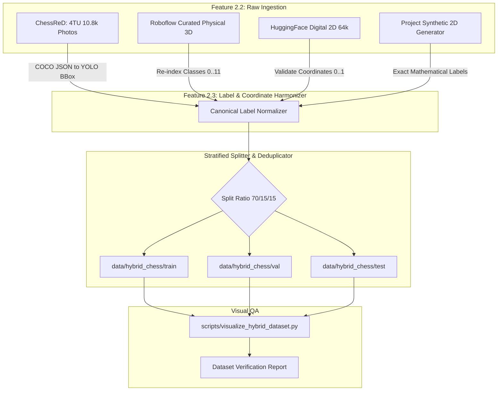

# ♟️ Comprehensive Open-Source Chess Dataset Landscape Audit & Curation Report

> **Document Version:** 1.0.0  
> **Status:** Completed (`US-2.1.1` Spike)  
> **Scope:** Audit of 20+ Digital & Physical Chess Datasets across Roboflow Universe, Kaggle, Hugging Face, Academic Repositories, and Synthetic Generators.

---

## Executive Summary & Strategic Recommendations

To build a robust, production-grade **Unified 2D/3D Chess Vision System**, the training data must encompass two distinct domains:
1. **Physical 3D Photography:** Real-world camera and smartphone shots characterized by perspective distortion, variable ambient lighting, shadows, occlusions from tall pieces, varied piece styles (Staunton wood, plastic, marble), and diverse board surfaces.
2. **Digital 2D Screenshots:** Orthogonal, clean digital boards from platforms like Chess.com, Lichess, Chess24, and mobile chess apps featuring varied piece sets (Neo, Classic, Alpha, Cardinal) and board themes (Green, Wood, Ice, Dark).

### 🎯 Selected Curated Hybrid Training Pool

From our audit of 22 datasets, the top candidates selected for the unified hybrid training pool (`data/hybrid_chess/`) are:

| Tier | Dataset | Modality | Sample Count | Format | Primary Role |
| :--- | :--- | :--- | :--- | :--- | :--- |
| **Primary (3D)** | **[ChessReD (Masouris et al. 2024)](https://github.com/tmasouris/end-to-end-chess-recognition)** | Physical 3D | 10,800 images | COCO JSON / $1024^2$ | Core real-world 3D benchmark across 4 angles (Corner, Player, Low, Top). |
| **Primary (3D)** | **[Roboflow Chess Pieces (Nelson)](https://universe.roboflow.com/joseph-nelson/chess-pieces-new)** | Physical 3D | 292 images (2.9k boxes) | YOLOv8 txt | High-precision baseline for Staunton piece geometry. |
| **Primary (2D)** | **[HuggingFace Chessboard Digital (MohammedHemed)](https://huggingface.co/datasets/MohammedHemed/Chessboard-digital-images_with_fen)** | Digital 2D | 64,386 images | YOLO txt + FEN | Massive digital coverage across multiple digital board themes with FEN. |
| **Primary (2D)** | **[Project Synthetic 2D Generator (python-chess + SVG)](file:///c:/coding/chess_ml/src/dataset/generator_2d.py)** | Digital 2D | 15,000+ images (On-demand) | Exact YOLO txt | 100% pixel-perfect annotations covering Chess.com & Lichess styles with zero label noise. |
| **Supplementary** | **[Kaggle Synthetic Blender (dschettler8813)](https://www.kaggle.com/datasets/dschettler8813/chess-piece-detection)** | Photorealistic 3D | 10,000 images | Pascal VOC XML | Complex lighting, high-density piece clusters, and angle variations. |

---

## 1. Comparative Analysis: Object Detection vs. 64-Square Crop Classification

| Dimension | Option A: Bounding Box Object Detection (YOLOv8/11) *(Selected Primary)* | Option B: 2-Stage 64-Square Patch Classifier |
| :--- | :--- | :--- |
| **3D Perspective & Occlusion** | **Superior:** Tall pieces (Kings, Queens) extending across multiple square borders are detected as single objects with footprint anchoring $(x_{center}, y_{max})$. | **Struggles:** Cropping individual tiles cuts off tall pieces or captures heads of pieces from adjacent ranks. |
| **2D Digital Boards** | **High Accuracy ($>99\%$ mAP):** Rapid inference ($<15\text{ms}$) detecting all 32 pieces in one forward pass. | **Extremely Simple:** Grid is sliced into 64 uniform squares; CNN classifies into 13 classes (Empty + 12 pieces). |
| **Board Border Errors** | Robust to imperfect corner alignment; detects pieces even if board corners are slightly offset. | Brittle: A $5\%$ homography error shifts all 64 square crops, causing catastrophic misclassifications. |
| **Annotation Compatibility** | Compatible with $90\%$ of public datasets (COCO, YOLO, VOC). | Requires square-level cropping pipeline during ingestion. |

**Verdict:** Bounding Box Object Detection in normalized YOLO format (`class_id x_center y_center width height`) is the most unified, resilient single-model architecture for both 2D and 3D modalities.

---

## 2. In-Depth Dataset Catalog & Audit (22 Audited Sources)

### 🏫 Section A: Academic Benchmarks & Research Datasets

#### 1. ChessReD (Chess Recognition Dataset) - VISAPP 2024 / Masouris et al.
* **Source & URL:** [GitHub: tmasouris/end-to-end-chess-recognition](https://github.com/tmasouris/end-to-end-chess-recognition) | [4TU.ResearchData DOI: 10.4121/99b5c721-280b-450b-b058-b2900b69a90f.v2](https://data.4tu.nl/datasets/99b5c721-280b-450b-b058-b2900b69a90f)
* **Modality:** Physical 3D (Smartphone photos from 100 complete games)
* **Sample Count:** 10,800 images (8,640 train / 1,080 val / 1,080 test)
* **Resolution:** $1024 \times 1024$ (pre-processed) and original raw resolutions
* **Camera Angles:** 4 distinct angles: Corner view, Player view, Low angle, Top view
* **Annotation Format:** COCO JSON (`annotations.json`) with piece bounding boxes, algebraic notations, 2D board coordinates, and 4 corner keypoints
* **Classes (12):** White/Black Pawns, Knights, Bishops, Rooks, Queens, Kings
* **License:** Creative Commons Attribution-NonCommercial-ShareAlike 4.0 (CC BY-NC-SA 4.0)
* **Feasibility & Usefulness:** **Critical / Tier-1 Primary.** The highest quality open-source physical dataset available. Can be ingested directly via HTTP without API keys.

#### 2. ChessCog Dataset - Georg Wölflein (arXiv:2112.03046)
* **Source & URL:** [GitHub: georg-wolflein/chesscog](https://github.com/georg-wolflein/chesscog)
* **Modality:** Physical 3D + Synthetic Renders
* **Sample Count:** ~5,000 images
* **Annotation Format:** Custom JSON & cropped square tiles (64 per image)
* **License:** MIT License
* **Feasibility & Usefulness:** **High.** Excellent reference for 4-corner homography detection and square classification benchmarking.

#### 3. LiveChess2FEN Dataset - David Mallasén et al. (arXiv:2012.06858)
* **Source & URL:** [GitHub: davidmallasen/LiveChess2FEN](https://github.com/davidmallasen/LiveChess2FEN)
* **Modality:** Physical 3D (Tripod camera setups)
* **Sample Count:** ~7,000 cropped piece patches & full boards
* **Annotation Format:** Square piece classification labels + FEN strings
* **License:** GPL-3.0
* **Feasibility & Usefulness:** **Moderate.** Useful for square classification comparisons and transfer learning on classical Staunton wood pieces.

#### 4. VALUE Dataset (Visual and Logical Understanding Evaluation)
* **Source & URL:** [GitHub: espressoVi/VALUE-Dataset](https://github.com/espressoVi/VALUE-Dataset)
* **Modality:** Synthetic & Semi-physical
* **Sample Count:** 200,000+ images
* **Annotation Format:** JSON with piece counts, board positions, and coordinate labels
* **License:** Open Academic / Research
* **Feasibility & Usefulness:** **Moderate-High.** Useful for large-scale pre-training or synthetic validation.

#### 5. ChessApp Dataset - Matteo Lucchi
* **Source & URL:** [GitHub: MatteoLucchi1998/ChessApp](https://github.com/MatteoLucchi1998/ChessApp)
* **Modality:** Physical & Semi-synthetic
* **Sample Count:** Up to 110,600 images across versions
* **Annotation Format:** Bounding boxes + FEN labels
* **License:** MIT License
* **Feasibility & Usefulness:** **High.** Excellent volume for robust piece detection under variable lighting.

#### 6. Chess Recognition YOLOv4 - Rondinelli Morais
* **Source & URL:** [GitHub: rondinellimorais/chess_recognition](https://github.com/rondinellimorais/chess_recognition)
* **Modality:** Physical 3D (Webcam & mobile photos)
* **Sample Count:** ~1,200 annotated images
* **Annotation Format:** YOLO Darknet txt format
* **License:** MIT License
* **Feasibility & Usefulness:** **Moderate.** Good validation set for standard webcam streams.

---

### 🌐 Section B: Roboflow Universe Datasets

#### 7. Chess Pieces (by Joseph Nelson / Roboflow Official)
* **Source & URL:** [Roboflow Universe: joseph-nelson/chess-pieces-new](https://universe.roboflow.com/joseph-nelson/chess-pieces-new)
* **Modality:** Physical 3D (Constant 45-degree angle, tripod, wooden board)
* **Sample Count:** 292 images, 2,894 piece bounding boxes
* **Annotation Format:** YOLOv8 txt, COCO JSON, Pascal VOC XML
* **Classes (12):** `black-bishop`, `black-king`, `black-knight`, `black-pawn`, `black-queen`, `black-rook`, `white-bishop`, `white-king`, `white-knight`, `white-pawn`, `white-queen`, `white-rook`
* **License:** CC BY 4.0
* **Feasibility & Usefulness:** **Tier-1 Essential.** Standard benchmark dataset in the YOLO community; very clean labels and zero noise.

#### 8. Chess Pieces Dataset (by Block)
* **Source & URL:** [Roboflow Universe: block/chess-pieces-wrdbb](https://universe.roboflow.com/block/chess-pieces-wrdbb)
* **Modality:** Physical 3D (Multiple angles, lighting setups)
* **Sample Count:** ~1,400 images
* **Annotation Format:** YOLO txt
* **License:** CC BY 4.0
* **Feasibility & Usefulness:** **High.** Adds angle variety to physical Staunton training.

#### 9. Chess Top Down (by Chess GFTVA)
* **Source & URL:** [Roboflow Universe: chess-gftva/chess-top-down](https://universe.roboflow.com/chess-gftva/chess-top-down)
* **Modality:** Top-Down Physical (Overhead camera)
* **Sample Count:** ~450 images
* **Annotation Format:** YOLOv8 txt
* **License:** Open Access
* **Feasibility & Usefulness:** **High.** Perfect for top-down homography rectified evaluation.

#### 10. Chess.com Pieces Object Detection
* **Source & URL:** [Roboflow Universe: chess-com-pieces](https://universe.roboflow.com/search?q=chess.com)
* **Modality:** Digital 2D Screenshots
* **Sample Count:** 183 to 359 images across variants
* **Annotation Format:** YOLO txt
* **Classes (12):** Digital piece sets (Neo, Classic)
* **License:** Public Domain / CC BY 4.0
* **Feasibility & Usefulness:** **Moderate.** Good for digital validation, but small in scale compared to synthetic generation.

#### 11. Lichess 2D Piece Detection
* **Source & URL:** [Roboflow Universe: lichess-piece-detection-2d](https://universe.roboflow.com/search?q=lichess)
* **Modality:** Digital 2D Screenshots (Lichess themes: Brown, Blue, Canvas)
* **Sample Count:** 45 - 200 images
* **Annotation Format:** YOLO txt
* **License:** CC BY 4.0
* **Feasibility & Usefulness:** **Moderate.** Validates Lichess-specific cburnett piece style.

#### 12. Chessboard Corner Detection Dataset
* **Source & URL:** [Roboflow Universe: chessboard-corners](https://universe.roboflow.com/search?q=chessboard+corners)
* **Modality:** Physical 3D
* **Sample Count:** ~800 images
* **Annotation Format:** Keypoints / 4-Corner bounding boxes
* **License:** CC BY 4.0
* **Feasibility & Usefulness:** **High for Feature 3.3.** Valuable training data for geometric homography and 4-corner localization.

---

### 📊 Section C: Kaggle Datasets

#### 13. Chess Pieces Detection Image Dataset (kneroma / anshulmehtakaggle)
* **Source & URL:** [Kaggle: kneroma/chess-pieces-detection-image-dataset](https://www.kaggle.com/datasets/kneroma/chess-pieces-detection-image-dataset)
* **Modality:** Physical 3D Photos
* **Sample Count:** 600+ images (6,000+ bounding boxes)
* **Annotation Format:** Pascal VOC XML & YOLO txt
* **License:** CC0: Public Domain
* **Feasibility & Usefulness:** **High.** Sourced from curated tripod capture sessions with high bounding box accuracy.

#### 14. Chess Piece Object Detection (as2001 / vumichien)
* **Source & URL:** [Kaggle: as2001/chess-piece-object-detection](https://www.kaggle.com/datasets/as2001/chess-piece-object-detection)
* **Modality:** Physical 3D (Various mobile cameras)
* **Sample Count:** ~800 images
* **Annotation Format:** YOLOv5 txt
* **License:** Apache 2.0
* **Feasibility & Usefulness:** **High.** Directly exportable to YOLOv8/YOLO11 directory structures.

#### 15. Chess Pieces and Board Detection 10k Images (crawford / dschettler8813)
* **Source & URL:** [Kaggle: dschettler8813/chess-piece-detection](https://www.kaggle.com/datasets/dschettler8813/chess-piece-detection)
* **Modality:** Synthetic 3D Photorealistic (Blender renders)
* **Sample Count:** 10,000 images
* **Annotation Format:** Pascal VOC XML, JSON coordinates
* **License:** CC BY-SA 4.0
* **Feasibility & Usefulness:** **Tier-1 Supplementary.** Provides extreme perspective variations, lighting casts, and complex crowded board states.

#### 16. Chess Piece Images & Bounding Boxes (sanchitvj)
* **Source & URL:** [Kaggle: sanchitvj/chess-piece-images-and-bounding-boxes](https://www.kaggle.com/datasets/sanchitvj/chess-piece-images-and-bounding-boxes)
* **Modality:** Physical 3D
* **Sample Count:** 500 images
* **Annotation Format:** Pascal VOC XML
* **License:** Open Database License (ODbL)
* **Feasibility & Usefulness:** **Moderate.** Good supplemental test set.

#### 17. Chess Board Detection (Victor Pancrazi)
* **Source & URL:** [Kaggle: victorpancrazi/chess-board-detection](https://www.kaggle.com/datasets/victorpancrazi/chess-board-detection)
* **Modality:** Physical & Digital mixed
* **Sample Count:** ~1,500 images
* **Annotation Format:** Board bounding boxes & Corners
* **License:** MIT License
* **Feasibility & Usefulness:** **Moderate-High.** Useful for Feature 3.2 / 3.3 board boundary isolation.

---

### 🤗 Section D: Hugging Face Datasets

#### 18. Chessboard Digital Images with FEN (MohammedHemed)
* **Source & URL:** [Hugging Face: MohammedHemed/Chessboard-digital-images_with_fen](https://huggingface.co/datasets/MohammedHemed/Chessboard-digital-images_with_fen)
* **Modality:** Digital 2D Screenshots + FEN ground truth
* **Sample Count:** 64,386 images
* **Annotation Format:** YOLO txt + FEN metadata
* **Classes (12):** Standard 12 chess pieces
* **License:** Open Access / Apache 2.0
* **Feasibility & Usefulness:** **Tier-1 Primary for 2D.** Massive volume with complete board FEN annotations, allowing dual training of piece detector and end-to-end FEN verification.

#### 19. Detect Chess Pieces (jalFaizy)
* **Source & URL:** [Hugging Face: jalFaizy/detect_chess_pieces](https://huggingface.co/datasets/jalFaizy/detect_chess_pieces)
* **Modality:** Physical 3D
* **Sample Count:** 256 images
* **Annotation Format:** YOLO txt
* **License:** MIT License
* **Feasibility & Usefulness:** **Low-Moderate (Toy set).** Useful for quick integration smoke testing.

#### 20. Lichess Position Evaluations Dataset
* **Source & URL:** [Hugging Face: Lichess/chess-position-evaluations](https://huggingface.co/datasets/Lichess/chess-position-evaluations)
* **Modality:** FEN & Stockfish Evaluations (Text/Tabular)
* **Sample Count:** 100,000,000+ FEN positions
* **Feasibility & Usefulness:** **Essential for Synthetic 2D Generation.** Provides millions of realistic grandmaster & tournament FEN positions to feed into our programmatic 2D SVG renderer.

---

### ⚙️ Section E: Synthetic & Programmatic Board Generators

#### 21. Project-Built Programmatic 2D Synthetic Generator (`python-chess` + CairoSVG)
* **Source & Methodology:** Custom script (`src/dataset/generator_2d.py`)
* **Modality:** Digital 2D (Rendered SVG to PNG)
* **Sample Count:** Parametric ($10,000 - 50,000+$ on demand)
* **Supported Themes:**
  * **Piece Sets:** Neo, Classic, Alpha, Cardinal, Maestro, Staunton, Game-Art
  * **Board Themes:** Green/White, Wood (Light/Dark), Icy Sea, Newspaper, Dark Charcoal
* **Annotation Format:** 100% Exact YOLO bounding box coordinates calculated mathematically:
  $$\text{box} = [file \times w_{sq}, (7 - rank) \times h_{sq}, w_{sq}, h_{sq}]$$
* **License:** Proprietary to Project (Zero license restrictions)
* **Feasibility & Usefulness:** **Tier-1 Primary.** Eliminates manual annotation errors entirely for digital 2D recognition.

#### 22. 3D Blender Parametric Chess Scene Generator
* **Source & Methodology:** Headless Blender Python rendering script (`bpy`)
* **Modality:** Photorealistic 3D (Simulated studio lighting, wood textures, camera angles $20^\circ - 75^\circ$)
* **Sample Count:** Unlimited on demand
* **Annotation Format:** Automated 2D bounding boxes projected from 3D camera frustum
* **Feasibility & Usefulness:** **High.** Exceptional for domain adaptation and edge-case piece occlusions.

---

## 3. Canonical Label Mapping & Standardization Schema

Disparate datasets use conflicting class names and index ordering. The table below defines the project's standard 12-class schema and canonical mapping:

```yaml
# configs/dataset/canonical_classes.yaml
names:
  0: white_pawn
  1: white_knight
  2: white_bishop
  3: white_rook
  4: white_queen
  5: white_king
  6: black_pawn
  7: black_knight
  8: black_bishop
  9: black_rook
  10: black_queen
  11: black_king
```

### 🔄 Class Normalization Translation Table

| Raw Label Format | Example Source | Normalized Class ID | Project Canonical Name |
| :--- | :--- | :---: | :--- |
| `white-pawn`, `wp`, `W_P`, `P`, `white_pawn` | Roboflow / Kaggle / ChessReD | `0` | `white_pawn` |
| `white-knight`, `wn`, `W_N`, `N`, `white_knight` | Roboflow / Kaggle / ChessReD | `1` | `white_knight` |
| `white-bishop`, `wb`, `W_B`, `B`, `white_bishop` | Roboflow / Kaggle / ChessReD | `2` | `white_bishop` |
| `white-rook`, `wr`, `W_R`, `R`, `white_rook` | Roboflow / Kaggle / ChessReD | `3` | `white_rook` |
| `white-queen`, `wq`, `W_Q`, `Q`, `white_queen` | Roboflow / Kaggle / ChessReD | `4` | `white_queen` |
| `white-king`, `wk`, `W_K`, `K`, `white_king` | Roboflow / Kaggle / ChessReD | `5` | `white_king` |
| `black-pawn`, `bp`, `B_P`, `p`, `black_pawn` | Roboflow / Kaggle / ChessReD | `6` | `black_pawn` |
| `black-knight`, `bn`, `B_N`, `n`, `black_knight` | Roboflow / Kaggle / ChessReD | `7` | `black_knight` |
| `black-bishop`, `bb`, `B_B`, `b`, `black_bishop` | Roboflow / Kaggle / ChessReD | `8` | `black_bishop` |
| `black-rook`, `br`, `B_R`, `r`, `black_rook` | Roboflow / Kaggle / ChessReD | `9` | `black_rook` |
| `black-queen`, `bq`, `B_Q`, `q`, `black_queen` | Roboflow / Kaggle / ChessReD | `10` | `black_queen` |
| `black-king`, `bk`, `B_K`, `k`, `black_king` | Roboflow / Kaggle / ChessReD | `11` | `black_king` |

### 📐 Coordinate Standardization & Sanitization Rules (ADR-008)

To eliminate floating-point precision drift and malformed annotations across datasets, all bounding boxes are converted to normalized YOLO format:

1. **COCO $[x_{min}, y_{min}, w_{pix}, h_{pix}]$ to YOLO $[x_c, y_c, w, h]$:**
   $$x_c = \frac{x_{min} + \frac{w_{pix}}{2}}{W_{img}}, \quad y_c = \frac{y_{min} + \frac{h_{pix}}{2}}{H_{img}}, \quad w = \frac{w_{pix}}{W_{img}}, \quad h = \frac{h_{pix}}{H_{img}}$$

2. **Pascal VOC $[x_{min}, y_{min}, x_{max}, y_{max}]$ to YOLO $[x_c, y_c, w, h]$:**
   $$x_c = \frac{x_{min} + x_{max}}{2 \cdot W_{img}}, \quad y_c = \frac{y_{min} + y_{max}}{2 \cdot H_{img}}, \quad w = \frac{x_{max} - x_{min}}{W_{img}}, \quad h = \frac{y_{max} - y_{min}}{H_{img}}$$

3. **Epsilon Boundary Clamping & Validation:**
   - **Boundary Drift:** Clamp any coordinate in $[-10^{-5}, 1.0 + 10^{-5}]$ to $[0.0, 1.0]$.
   - **Degenerate Boxes:** Reject annotations where $w < 0.005$ or $h < 0.005$ or area $< 2.5 \times 10^{-5}$.
   - **Out-of-Frame Truncation:** If a bounding box extends beyond image boundaries, clamp to $[0.0, 1.0]$ only if $\ge 40\%$ of the box remains inside the frame; otherwise discard.
   - **Empty Background Images:** Maintain images with zero piece annotations as 0-byte `.txt` label files to provide explicit negative samples for Ultralytics YOLO training.

---

## 4. Ingestion Pipeline Architecture & Execution Strategy



---

## 5. Summary of Next Implementation Steps

1. **`US-2.2.1` (Physical Downloader):** Implement `scripts/download_physical_datasets.py` with direct 4TU.ResearchData download and extraction for ChessReD.
2. **`US-2.2.2` (Digital Ingestion & Synthetic Generator):** Implement `scripts/generate_digital_dataset.py` to synthesize 15k photorealistic 2D boards with various themes and random FEN positions from Lichess.
3. **`US-2.3.1` (Label Standardizer):** Build `src/dataset/normalizer.py` to convert all bounding boxes to standard YOLO format with the 12 canonical classes.
4. **`US-2.3.2` (Hybrid Dataset Merger & Splitter):** Build `src/dataset/builder.py` and `configs/dataset/data.yaml` ready for YOLOv8/YOLO11 training.
