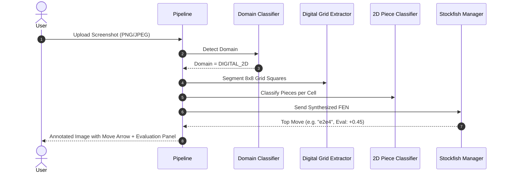
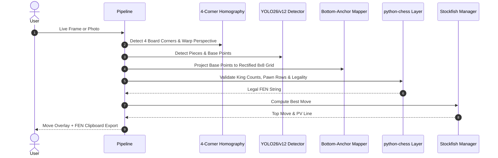

# 🎯 Functional Specification: Use Cases & Workflows

## 1. Overview
The **Unified 2D/3D Chess Vision & Move Recommendation System** supports two primary operational modes:
1. **Digital 2D Screenshots** (Chess.com, Lichess, PDF diagrams, chess streams).
2. **Physical 3D Photos & Video Streams** (Smartphone captures, webcam over-the-board recordings, tournaments).

---

## 2. Core User Journeys

### ♟️ Use Case 1: Digital Screenshot Analysis (2D)

### 📷 Use Case 2: Physical Over-the-Board Camera Capture (3D)

---

## 3. Supported Input Modalities
* **Static Images:** `.png`, `.jpg`, `.jpeg`, `.webp`, `.bmp`.
* **Video & Live Streams:** RTSP, USB Webcam, MP4/AVI video files (processed at target framerate e.g., 10-30 FPS).
* **CLI / API:** Base64-encoded image payloads or local file paths.
