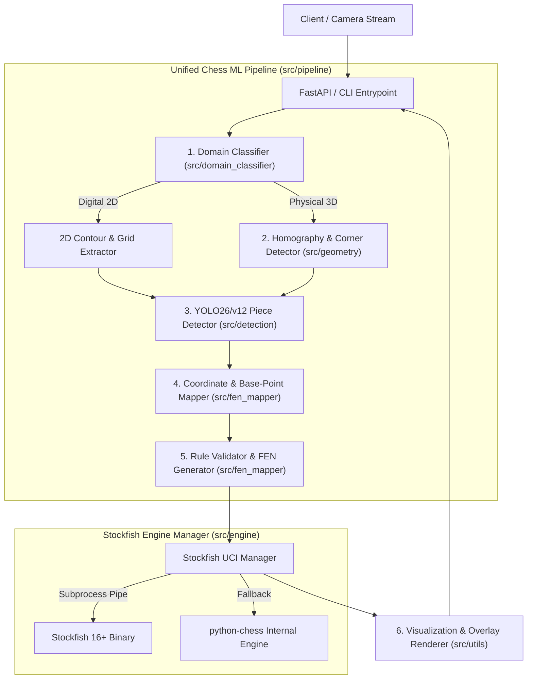

# 🏗️ Technical Architecture & Pipeline Design

## 1. System Overview (C4 Container Diagram)

---

## 2. Component Directory Architecture

| Package | Responsibility | Primary Classes / Functions |
| :--- | :--- | :--- |
| **`src/schemas`** | Pydantic v2 data contracts | `PieceDetection`, `BoardStateResult`, `EngineEvaluation` |
| **`src/domain_classifier`** | Detects digital vs. physical images | `DomainClassifier`, `classify_domain()` |
| **`src/geometry`** | Corner detection & Homography | `CornerDetector`, `compute_homography()`, `warp_board()` |
| **`src/detection`** | YOLO piece & keypoint inference | `YOLOPieceDetector`, `ONNXInferenceEngine` |
| **`src/fen_mapper`** | Base-to-grid mapping & FEN rules | `FENMapper`, `validate_legal_state()` |
| **`src/engine`** | UCI Stockfish wrapper & fallback | `StockfishManager`, `query_evaluation()` |
| **`src/pipeline`** | End-to-end orchestration | `ChessVisionPipeline`, `process_image()` |
| **`src/utils`** | Image plotting, arrows, metrics | `draw_board_overlay()`, `setup_logger()` |
